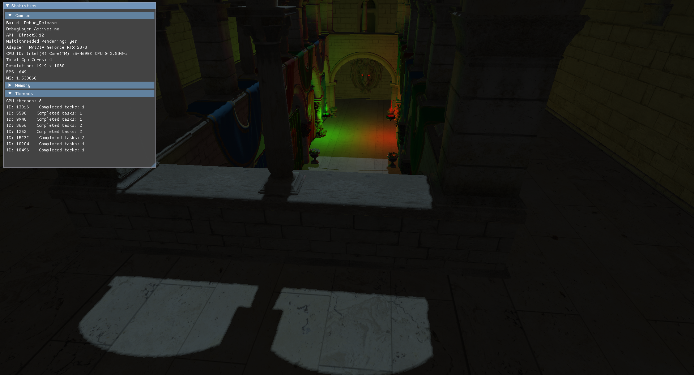

# BeLuEngine
I began this project during the fourth year of my university program in order to have a starting point for the course "Large Game Project" which began at the start of year five.
The engine was used in that course by me and nine fellow students to create a game called "Hell Loop". See [link](https://www.youtube.com/watch?v=EPoPFmjj784&ab_channel=CanalTenThousand). 
Today, I mainly use this engine (more like a renderer) as a framework to learn features and techniques focused on rendering/graphics.
The project is developed on windows platform where I use Visual Studio 2019 (Community edition) as platform.

## Screenshots
### 22-02-2021_SPONZA

---
## Roadmap
##### Reflections using the raygen & closest-hit shaders
##### Something with the geometry and tesselation shaders
##### Decals
##### Volumetric light
---

## The structure of the VS solution
The solution is, as of the date of writing this document, divided into three(3) projects.
The projects are: Engine, Game and Sandbox.

##### Engine
The Engine project is where the game engine is developed. Rendering features and whatnot.
This project creates a static library which is linked to other projects in this solution.

##### Game
This project is where a future game itself should be developed. It is staticly linked to the library that Engine creates.

##### Sandbox
This project is a playground for testing out features developed in the engine.
It is staticly linked to the library that Engine creates.

---
## API
Currently the only API supported is DirectX12.

---
## Feature List
Here I will list all the features (that is worth mentioning) implemented in my rendering framework.
##### Entity Component System
##### PBR using roughness and metallic maps
##### Multi-threading
##### Picking (with Boundingboxes)
##### Stencil-buffer outlining
##### Hard Shadows with inline ray tracing

---
## Setting up the project, welcome to premake! (Thanks to Tim Johansson for setting up and making this guide)
This project uses premake5 to create any necessary files for the Visual Studio IDE.
Note that the setup only is aimed for contributors who use Visual Studio 2019 on Windows.

##### Step 1. Download the Premake5 executable
Make sure that you have premake downloaded! This [link](https://github.com/premake/premake-core/releases/download/v5.0.0-alpha15/premake-5.0.0-alpha15-windows.zip) goes to the download of premake5.

##### Step 2. Place the Premake5 executable
Place the downloaded executable in some accessible and "easy to find" folder on your computer. For example under the C drive such that the complete path to the executable becomes "C:\\Premake\\premake5.exe"

##### Step 3. Add premake5 to the path environment variable
The title says it all. Edit the enviroment variable "path" under systemvariables. Add the path to the previously placed Premake folder (e.g. C:\\Premake\\) and save.

##### Step 4. Build a VS solution
Almost done! Make sure to clone the Github repo and edit the build.bat file after your preference. It is however ready to build a solution for Visual Studio 2019 by default.
Run the bat file and open the solution.
